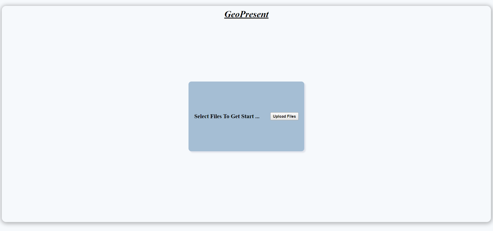
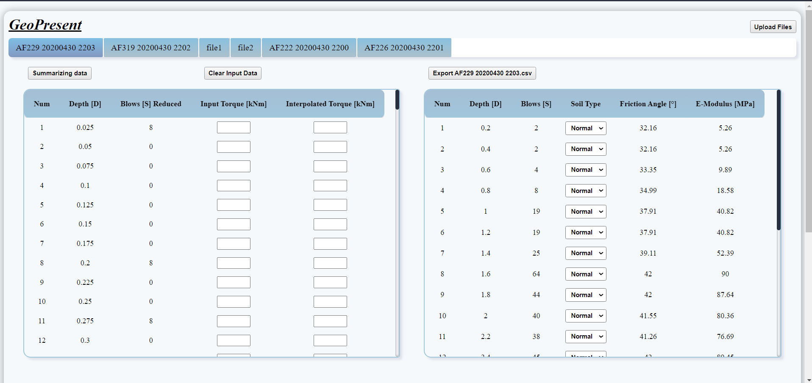
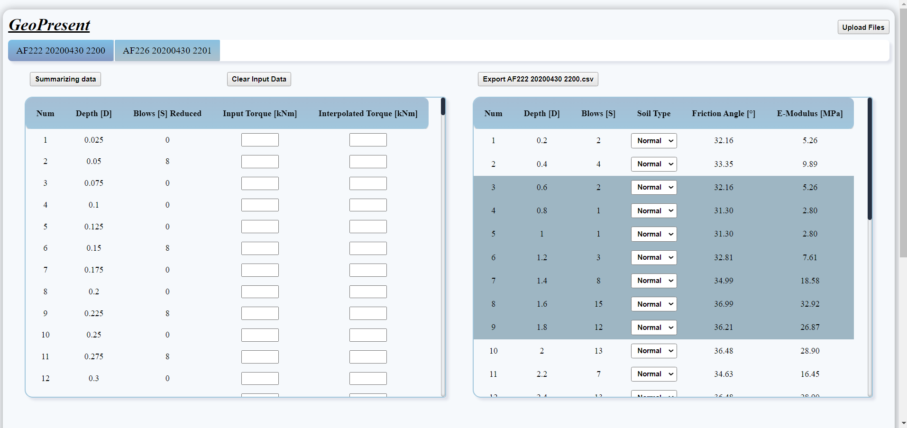
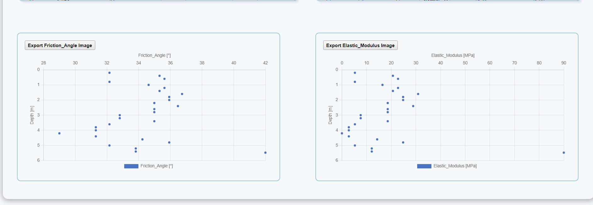
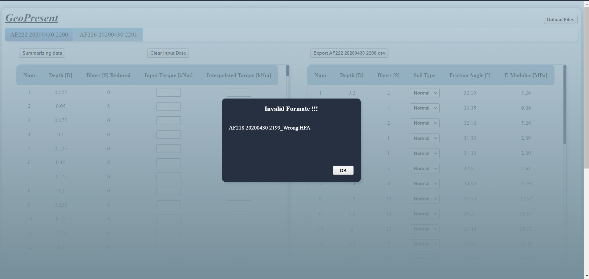
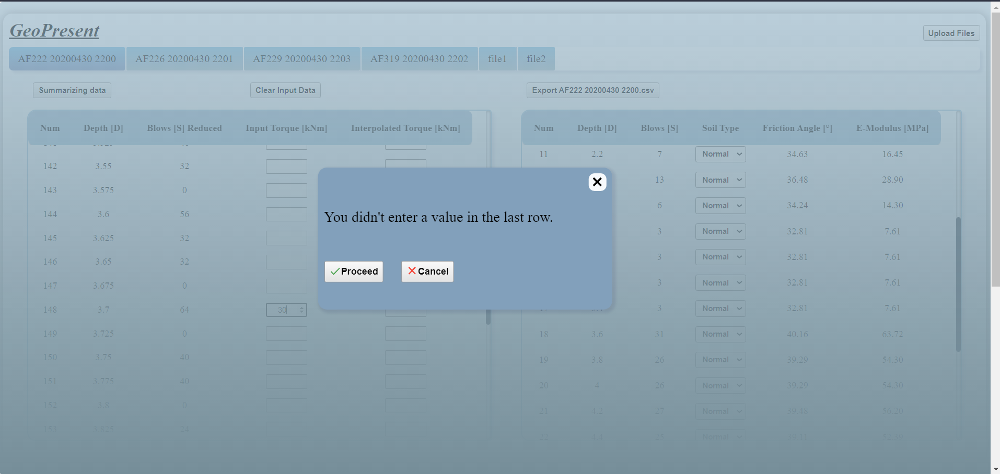

# Automation Project

## 📌Note

### Please note that this project is developed for a specific client and the source code, as well as the live demo link, are kept private. If you have any questions about this project or would like to know more, please feel free to contact me.

## Contact Me

If you have any questions about this project, feel free to reach out to me via :

- LinkedIn: <a href="https://www.linkedin.com/in/mohamed-salah-a74b5b234/">Mohamed Salah</a>

- Email: <a href="mailto:mohamedsalah.dev991@gmail.com">mohamedsalah.dev991@gmail.com</a>

## Project Description

I have developed a React.js automation project that streamlines and automates various processes involved in evaluating soil properties and generating chart images and files. The project focuses on the evaluation of the friction angle and elastic modulus of frictional soil.

The automation project encompasses several steps to efficiently process the data and produce accurate results. Here's an overview of the key steps involved:

## Key Steps in the Automation Process

1. **Parsing of Data**: The project starts by parsing the raw data obtained from the Hfa-file. This data contains crucial information such as the measured number of blows (S) required to penetrate a specific depth (D) in the soil.

2. **User Input of Torque**: The system allows users to input torque values associated with the soil data. This user input is essential for the subsequent data analysis and calculations.

3. **Summarize the Data**: In this step, the system summarizes the processed data, ensuring that all the required information is available for further analysis. It handles data sorting, verification, and validation to ensure data integrity.

4. **Calculation of Friction Angle and Elastic Modulus**: Using the summarized data, the system performs calculations to determine the friction angle and elastic modulus of the frictional soil. These calculations involve complex algorithms and formulas, which are executed automatically by the system.

5. **User Input of Soil Type**: The automation project allows users to input the type of soil associated with the data. This input enables the system to refine the analysis and provide more accurate results tailored to the specific soil type.

6. **Output and Illustration of Data**: Finally, the system generates comprehensive outputs, including chart images and files that illustrate the evaluated data. These outputs provide a visual representation of the soil properties, making it easier for users to interpret and utilize the results.

By automating these processes, the project significantly enhances the efficiency and accuracy of evaluating soil properties. It eliminates the need for manual data processing and complex calculations, saving time and reducing the chances of human error.

## Features

- User-friendly design and easy to use.
- Read data from multiple files.
- Error handling for data processing.
- Generate and export:
  - New file with specific data and extension.
  - Chart image with graph information.
- Multiple select table rows and apply actions.

## Project Benefits

- Increased Efficiency: By automating critical processes, the project improves productivity and reduces manual effort in soil evaluation tasks.
- Enhanced Accuracy: The automated calculations and data processing minimize the risk of human error, ensuring accurate results.
- Time Savings: The automation project eliminates the need for manual data processing and complex calculations, saving time and enabling professionals to focus on analysis and decision-making.
- User-Friendly Interface: The project provides a user-friendly interface for data input and result visualization, making it accessible to users with varying levels of technical expertise.

## Video Demo

<video width="100%" height="500" controls>
  <source src="./Files/Record.mp4" type="video/mp4">
  Your browser does not support the video tag.
</video>

## Screenshots

Here are some screenshots from the project:

### Get Start

### Tables

### Multiple Select

### Charts

### Invalid Formate

### Confirm Value In The Last Row

## Libraries Used

- React
- React Chart.js
- React CSV
- html2canvas
- xlsx

## Conclusion

This automation project showcases my expertise in developing efficient and reliable solutions for analyzing and evaluating soil properties. It demonstrates my ability to handle complex data processing, calculations, and user interactions within a React.js environment. By implementing this automation project, professionals in soil analysis and engineering can streamline their workflows, make informed decisions, and achieve greater efficiency in their daily work.

## License

This project is licensed under the [MIT License](https://opensource.org/licenses/MIT) - see the [LICENSE](LICENSE) file for details.

## Contact

Mohamed Salah - [Linked In](https://www.linkedin.com/in/mohamed-salah-a74b5b234/)

Project Link: [https://github.com/Mohamed-Salah991/Soil-Properties-Automation]
